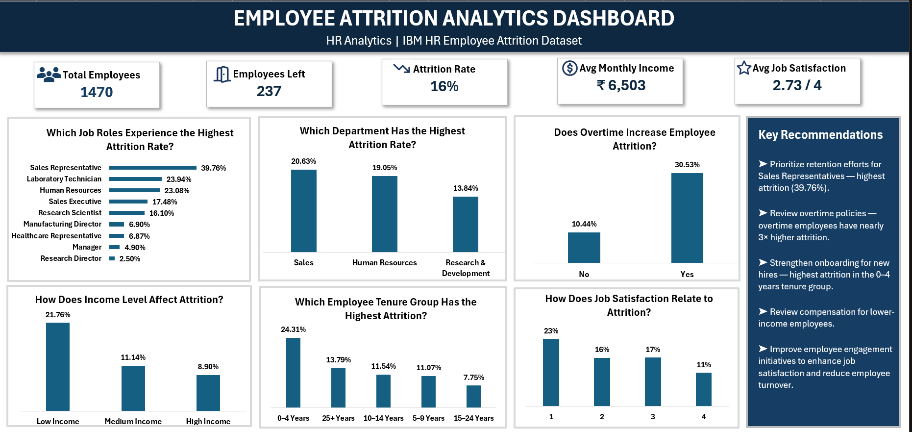

# 📊 Employee Attrition Analytics Dashboard

---

# 📖 About the Project

Employee attrition is one of the most significant workforce challenges faced by organizations. Understanding why employees leave enables businesses to improve retention, reduce hiring costs, and make informed workforce decisions.

This project presents an **Employee Attrition Analytics Dashboard** built in **Microsoft Excel** using the IBM HR Analytics dataset. The dashboard transforms raw HR data into meaningful business insights through executive KPI cards, analytical visualizations, and actionable business recommendations.

---

# 🎯 Business Objective

To analyze employee attrition, identify the key factors influencing employee turnover, and provide actionable insights that support data-driven HR decision-making.

---

# 🛠 Tools & Technologies

---

# 📊 Dashboard Preview

---

# ✨ Key Dashboard Features

- Executive KPI Cards
- Department-wise Attrition Analysis
- Job Role Attrition Analysis
- Overtime Impact Analysis
- Income Level Analysis
- Employee Tenure Analysis
- Job Satisfaction Analysis
- Business Recommendation Panel

---

# 📈 Key Business Insights

- Sales Representatives recorded the highest attrition rate (**39.76%**).
- Employees working overtime experienced nearly **3× higher attrition** than employees not working overtime.
- Employees with **0–4 years** of tenure showed the highest attrition.
- Lower-income employees experienced the highest employee turnover.
- Lower job satisfaction was associated with higher attrition.

---

# 💼 Business Recommendations

➜ Prioritize retention initiatives for Sales Representatives.

➜ Review overtime policies to improve employee well-being.

➜ Strengthen onboarding and support programs for new employees.

➜ Evaluate compensation strategies for lower-income employees.

➜ Improve employee engagement initiatives to enhance job satisfaction and reduce turnover.

---

# 💡 Skills Demonstrated

- Data Cleaning & Transformation using Power Query
- Data Modeling with Pivot Tables
- Advanced Excel Formulas
- KPI Design & Performance Reporting
- Dashboard Development
- HR Analytics
- Data Visualization
- Business Storytelling
- Decision Support Analytics

---

# 👤 Author

### **Tanusri Nowpada**

💼 **LinkedIn:** https://www.linkedin.com/in/tanusri-nowpada/

💻 **GitHub:** https://github.com/TanusriNowpada

---

### ⭐ Thank you for visiting this repository.

